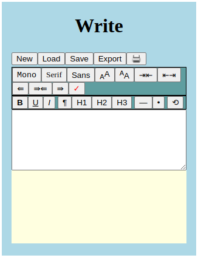
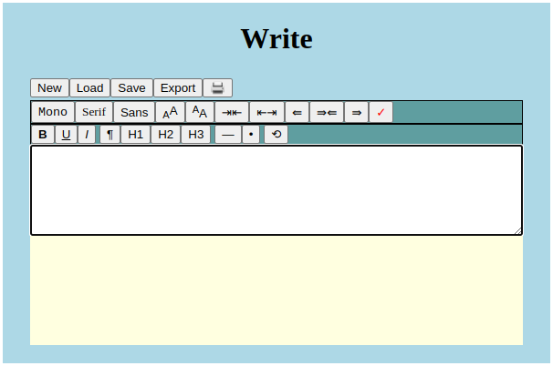
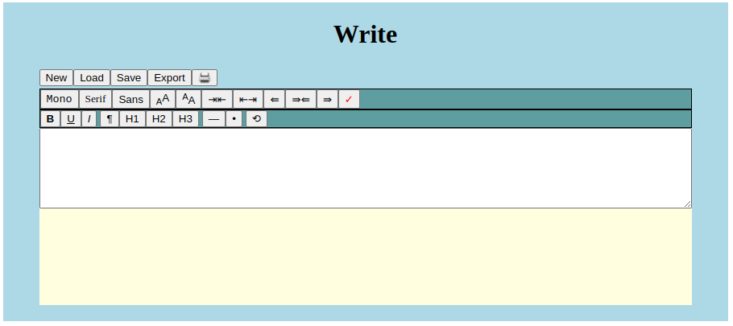

# Write

If the notes program is not enough this provides for basic word processing.  It is a basic program but gives just enough to produce good looking documents that can be saved in its own JSON format or exported to html.

## File features:

* New
* Load - loads files saved by this program.
* Save - saves a JSON file containing the content and the settings.
* Export - creates a standalone HTML file for viewing, printing, publishing, etc.
* Print - will use the broswer's default print function. Note the ability to print may be different on different devices.

## Global document settings.

* Choose from a mono spaced, serif, or sans serif font.  This is a global font setting.
* Choose overall font sizing (headings scale with baseline font).
* Decrease or increase right/left margins.
* Align document to left, center or right.
* Enable or disable spell check.

## Edit Selection

* Apply bold, underline, or italic to selected area.
* Take selection and make it a paragraph or header.
* Insert bullets or horizontal line dividers.
* Undo a mistake (there are 316 levels of undo).
### Mobile:

### Tablet:

### Laptop:

